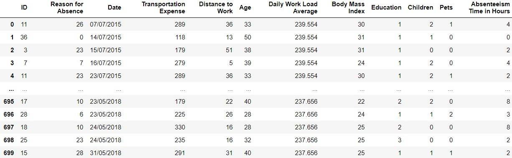
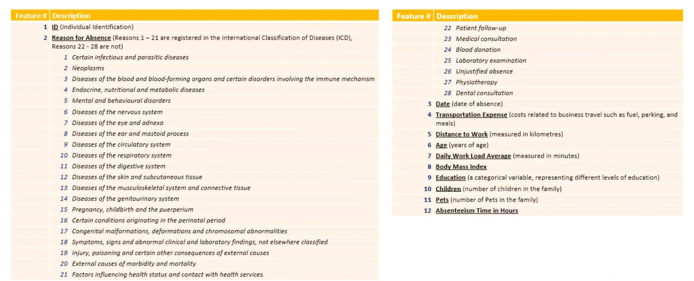
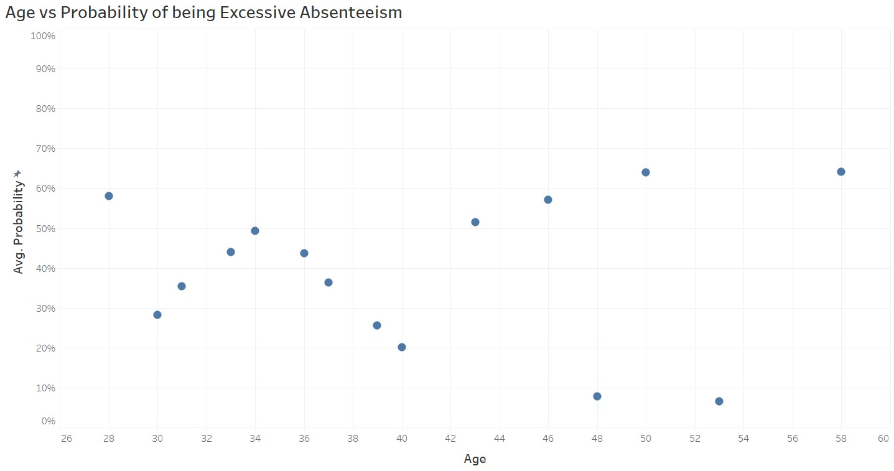
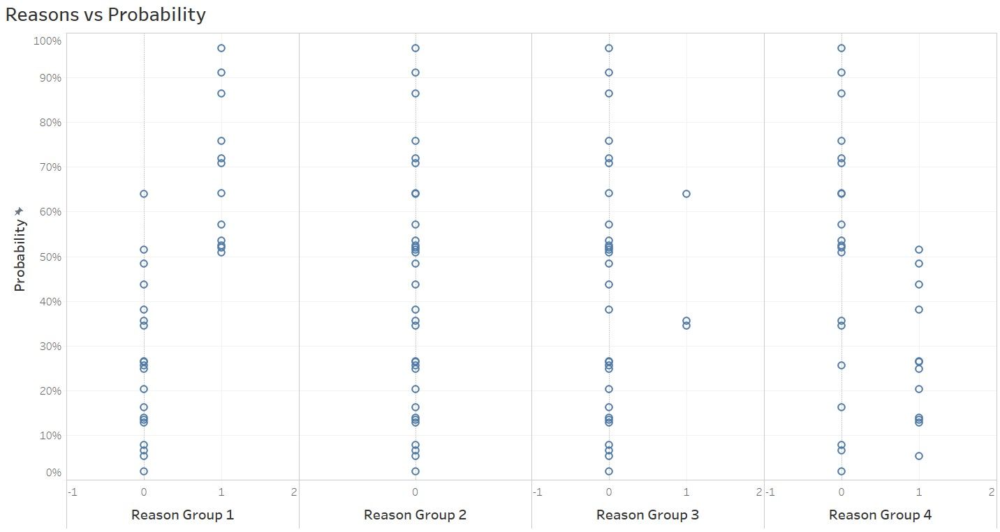
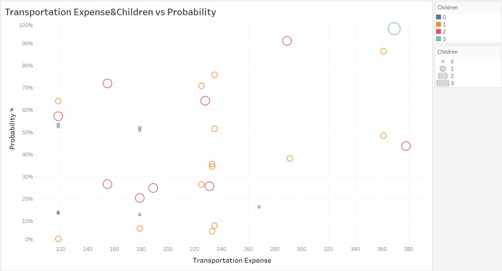

# Absenteeism Prediction in a company
## What is Absenteeism?
&nbsp;&nbsp;&nbsp;&nbsp;Absenteeism is the behavior that ones are absent during the working time. In this case, we are trying to predict whether ones will have excessive absenteeism or not. From our dataset Absenteeism_data.csv, there is a column named 'Absenteeism Time in Hours'. We will use this as labels for our model.  
After we find the mean of the 'Absenteeism Time in Hours', we get a mean of 3. So, we convert all value larger than 3 to be 1 and 0 otherwise.  
If the label is 1, it means that person is likely to be excessive absenteeism and vice versa.  

## WHY is it important?
&nbsp;&nbsp;&nbsp;&nbsp;If we can predict employees' absenteeism behavior, we can adjust the workload or other factors to match employees' need, so they won't have absenteeism anymore or have very less. With the fact that absenteeism can indicate the burnout for customers, if we can predict and avoid it, we can prevent employees taking away from the company.

## Example of dataset (from data/Absenteeism_data.csv)

## Feature descriptions

## Our approach step in a nutshell:
<b>*** Please refer to .ipynb files for full details ***</b>
1. Preprocess Data  
2. Create Dummies for Reasons for Absense
3. Group Reason for Absense into 4 groups following the similarity of reasons (it makes more sense to do it in this way, because if we use all reasons as individuals, with this small set of data, we might not be able to find any useful insights)  
-- <b>Reason Group 1</b>: Reason 1 to 14 (We can call this group <b>'Diseases'</b>)  
-- <b>Reason Group 2</b>: Reason 15 to 17 (We can call this group <b>'Pregnancy'</b>)  
-- <b>Reason Group 3</b>: Reason 18 to 21 (We can call this group <b>'Poisoning'</b>)  
-- <b>Reason Group 4</b>: Reason 22 to 28 (We can call this group <b>'Light reasons'</b>)  
5. Create the Logistic Regression model and make prediction
6. Export the result to SQL and save as a .csv file
7. Visualize the result in Tableau and integrate the result

## Results
&nbsp;&nbsp;&nbsp;&nbsp;After we do backward elimiation and adjust the Logistic Regression model. We achieve <b>75% accuracy</b> on test set. This is not bad at all from our points of view because this is not some usual tasks to predict behavior.  
    
&nbsp;&nbsp;&nbsp;&nbsp;The graph below is the <b>'Age vs Probability of being excessive absenteeism'</b> visualization from Tableau. We used mean of probability for each age to plot this graph.  
  
&nbsp;&nbsp;&nbsp;&nbsp;<b><u>Interpretation:</u></b> We can barely see the <b>weak linear uptrend correlation</b>. We might unconfidently say that age affect the absenteeism behavior; the higher age ones are, the higher probability ones will be excessive absenteeism. However, we might need more data to confidently confirm this hypothesis.
  
  
  
&nbsp;&nbsp;&nbsp;&nbsp;The second visualization, the graph below, is <b>'Reasons vs Probability of being excessive absenteeism'</b>. This one is have a good insight.  
  
&nbsp;&nbsp;&nbsp;&nbsp;<b><u>Interpretation:</u></b> Employees who are absent because of reasons in group 1 have <b>over 50%</b> probability of being excessive absenteeism, on the other hand employees who are not absent with reasons in group 1 have <b>less than 50%</b> probability of being excessive absenteeism. This makes very much sense because the first reason group is <b>'Diseases'</b> group. If ones have diseases, ones have to be absent from works to see doctor especially those employees who have long-term diseases. Sadly for reason group 2 and 3, we can tell nothing, the results are <b>distributed all over equally</b>. We might collect more data to see the insight from these 2 group. For the group 4, we can see that employees who are absent due to these reasons in group 4 have <b>less than 50%</b> probability to be excessively absenteeism. This is intuitive because th reasons in group 4 are 'Light reasons'. These reasons won't have any physical or mental damage, so it won't affect the work at all.  
  
  
  
&nbsp;&nbsp;&nbsp;&nbsp;The last visualization, the graph below, is <b>'Transportation Expense&Childs vs Probability of being excessive absenteeism'</b>. For this graph, we plot Transpartation Expense against the probability , and we use color and size of data dots to represent no. of childs.  
  
&nbsp;&nbsp;&nbsp;&nbsp;<b><u>Interpretation:</u></b> We can see a very very <b>weak uptrend linear correlation</b> again. We can unconfidently say the higher tranportation, the higher ones will be excessive absenteeism. However we need more data to confirm this hypothesis. For no. of child, the distribution is spread out all over, we cannot see any correlation clearly. But there is a employee who have 3 childs has very high probability of being excessive absenteeism. This is an <b>outlier</b> in our data. Anyways, it is a good clue that if we collect more data and gather more employees who have 3 childs, we might see some insight.  
  

  
## Files explanation:  
In 'data' folder:  
* Absenteeism_data.csv is the main data before preprocessing  
* Absenteeism_preprocessed.csv is the main data after preprocessing  
* Absenteeism_new_data.csv is the data for final testing  
* Absenteeism_new_data_prediction.csv is the tested data with added prediction column for using in Tableau  
  
In 'pickle' folder:  
* absenteeism_model.pickle for prediction model  
* custom_scaler.pickle for scaling the new data before put in the model  
  
Database:  
* db_table_creation.sql for creating the table and columns in the database  
  
IPynb and Py:  
* .py is for model module to do everything we did in .ipynb in another file 
* Main for all coding part and name after what that file does
  
## Libraries used:
numpy, pandas, sklearn, pickle, pymysql

## Link to Tableau visualization
https://public.tableau.com/profile/ariya.sontrapornpol#!/vizhome/AbsenteeismPredictionVisualization_16142177647250/AgevsProbability
